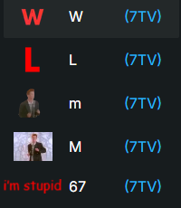

# SpaceTTVK Emotes

Chrome extension that adds **7TV**, **BTTV**, and **FFZ** emote autocomplete to **Twitch** and **Kick** chat using the `:` trigger.

Type `:` followed by an emote name (for example `:W` or `:pepe`) and pick from the dropdown with your mouse or keyboard.



## Features

- `:` emote search in chat (like the reference UI)
- Emote preview image, name, and provider tag `(7TV)` / `(BTTV)` / `(FFZ)`
- Keyboard navigation: ↑ ↓ to move, Enter or Tab to insert, Esc to close
- Loads global + channel emotes automatically when you open a stream
- Works on Twitch (`twitch.tv`) and Kick (`kick.com`)

## Supported providers

| Provider | Twitch | Kick |
|----------|--------|------|
| 7TV      | Yes    | Yes  |
| BTTV     | Yes    | Yes (global + linked Twitch channel) |
| FFZ      | Yes    | Yes (global + linked Twitch channel) |

On Kick, BTTV and FFZ channel emotes are loaded when the streamer has a matching Twitch account (same username, or a `twitch.tv/...` link in their Kick bio). Global BTTV and FFZ emotes always work on Kick.

## Install (developer / unpacked)

1. Open Chrome and go to `chrome://extensions`
2. Enable **Developer mode** (top right)
3. Click **Load unpacked**
4. Select this folder: `SpaceTTVK`
5. Open a Twitch or Kick stream and type `:` in chat

## Usage

1. Go to any live channel on Twitch or Kick
2. Click the chat input
3. Type `:` and start typing an emote name
4. Use ↑↓ or hover to highlight an emote
5. Press **Enter** or click to insert the emote code

The extension inserts the emote **text code** (for example `LUL` or `pepeLaugh`). Rendering still depends on each site’s emote support (7TV/BTTV/FFZ extensions or native Kick 7TV support).

## Project structure

```
SpaceTTVK/
├── manifest.json
├── popup.html
├── icons/
├── src/
│   ├── background.js   # Fetches & caches emotes
│   ├── emotes.js       # 7TV / BTTV / FFZ API helpers
│   ├── content.js      # Chat autocomplete UI
│   └── autocomplete.css
└── README.md
```

## Permissions

- **storage** — cache emote lists locally for faster loading
- **host_permissions** — Twitch/Kick pages plus 7TV, BTTV, and FFZ APIs/CDNs

## License

MIT
